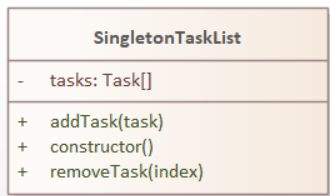
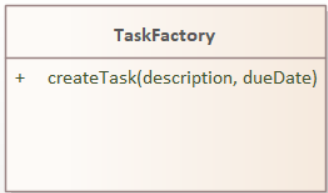
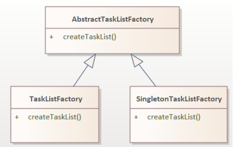
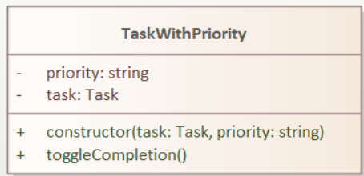
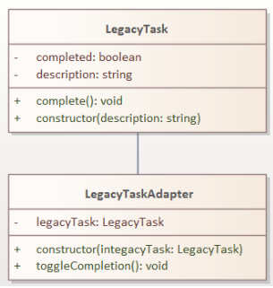
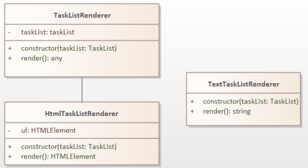
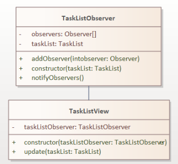
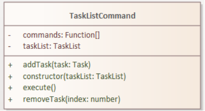

# To Do App JS 

# Principiile SOLID (SOLID PRINCIPLES)

**Principiul Responsabilității Unice (Single Responsibility Principle):**

Fiecare clasă din cod este responsabilă pentru un aspect al funcționalității aplicației. Clasa Task: reprezintă o singură sarcină, având o descriere și un statut de finalizare. Clasa DueDateTask: reprezintă o sarcină cu o dată de scadență, extinzând clasa Task. Clasa TaskList: gestionează o listă de sarcini și este responsabilă de adăugarea și eliminarea sarcinilor. Clasa TaskRenderer: responsabilă de afișarea listei de sarcini în DOM.
Aceste principii asigură o structură clară și modularitate în codul aplicației To Do, permițând o mai mare flexibilitate și ușurință în dezvoltarea și întreținerea aplicației.
```
class Task {
    constructor(description) {
        this.description = description; 
        this.completed = false; 
    }
    toggleCompletion() {
        this.completed = !this.completed;
    }
}
```
Task.png)

Clasa Task are următoarele atribute și metode:

Atribute:
- description: string: Reprezintă descrierea sarcinii.
- completed: boolean: Indică dacă sarcina este finalizată (true) sau nu (false).

Metode:
+ constructor(description): Inițializează o nouă instanță a clasei Task cu descrierea furnizată. Atributul completed este setat implicit la false.
+ toggleCompletion(): Inversează starea de finalizare a sarcinii. Dacă sarcina este finalizată, atributul completed devine false, și viceversa.

**Principiul deschis/închis (Open/Closed Principle):**

Clasele ar trebui să fie deschise pentru extindere, dar închise pentru modificare. Codul este conceput astfel încât să permită extinderea claselor fără a modifica implementarea acestora. Clasa DueDateTask extinde clasa Task fără a o modifica. Clasa TaskRenderer poate gestiona ambele instanțe Task și DueDateTask fără a-și modifica implementarea.
```
class DueDateTask extends Task {
    constructor(description, dueDate) {
        super(description);
        this.dueDate = new Date(dueDate);
    }

        isOverdue() {
        const now = new Date();
        return this.dueDate < now && !this.completed;
    }
}
```
.png)

Clasa DueDateTask extinde clasa Task și adaugă un nou atribut și o nouă metodă:

Atribute:
- dueDate: Date: Reprezintă data scadenței sarcinii.

Metode:
+ constructor(description, dueDate): Inițializează o nouă instanță a clasei DueDateTask cu descrierea și data scadenței furnizate. Constructorul clasei părinte (Task) este apelat folosind super(description).
+ isOverdue(): Verifică dacă sarcina este în întârziere sau nu. Utilizând data curentă (now) și data scadenței (dueDate), funcția returnează true dacă sarcina este în întârziere (dueDate este mai mică decât now) și dacă sarcina nu este finalizată (completed este false).

**Principiul substituției Liskov (Liskov Substitution Principle ):**

Subtipurile ar trebui să poată fi înlocuite cu tipurile lor de bază fără a modifica corectitudinea programului. Clasa DueDateTask, care este derivată din clasa Task, demonstrează LSP. Clasa TaskRenderer gestionează ambele instanțe Task și DueDateTask, iar logica de generare rămâne corectă pentru ambele tipuri. Aceasta arată că clasa derivată (DueDateTask) poate înlocui clasa de bază (Task) fără a afecta corectitudinea programului.
```
class TaskRenderer {
    constructor(taskList, containerId) {
        this.taskList = taskList; 
        this.container = document.getElementById(containerId); /
}
```
.png)

Clasa TaskRenderer are următoarele atribute și metode:

Atribute:
- taskList: TaskList: Reprezintă lista de sarcini care urmează să fie afișată.
- container: HTMLElement: Reprezintă elementul container din interfața utilizator în care se vor afișa sarcinile.

Metode:
+ constructor(taskList, containerId): Inițializează o nouă instanță a clasei TaskRenderer cu lista de sarcini și ID-ul containerului furnizate.

**Principiul de segregare a interfeței (Interface Segregation Principle ):**

Subtipurile ar trebui să poată fi înlocuite cu tipurile lor de bază fără a modifica corectitudinea programului. Clasa TaskRenderer demonstrează ISP-ul deoarece depinde de setul minim de metode și proprietăți de care are nevoie din clasele TaskList și Task. Nu depinde de metode sau proprietăți inutile.

**Principiul inversării dependenței ( Dependency Inversion Principle ):**

Modulele de nivel înalt nu ar trebui să depindă de modulele de nivel scăzut. Ambele ar trebui să depindă de abstracții. Clasa TaskRenderer urmează DIP, deoarece depinde mai degrabă de abstracții (clasa TaskList) decât de implementări concrete. Constructorul clasei TaskRenderer acceptă un obiect taskList și un containerId ca parametri, decuplându-l de implementări specifice sau de structura DOM. Acest lucru permite o modularitate mai bună și o testare mai ușoară.

# Design Patterns
# Creational Design Patterns

**Singleton Pattern**

Modelul Singleton asigură că o clasă are o singură instanță, oferind în același timp un punct de acces global la această instanță. Clasa SingletonTaskList asigură că există o singură instanță a TaskList prin utilizarea unei instanțe de proprietate statică. Constructorul verifică dacă o instanță a SingletonTaskList există deja și, dacă există, returnează instanța existentă. Dacă nu, creează o instanță nouă și o salvează ca SingletonTaskList.instance.

```
class SingletonTaskList {
    constructor() {
        if (!SingletonTaskList.instance) {
            this.tasks = [];
            SingletonTaskList.instance = this;
        }
        return SingletonTaskList.instance;
    }

    addTask(task) {
        this.tasks.push(task);
    }

    removeTask(index) {
        this.tasks.splice(index, 1);
    }
}
```


Clasa SingletonTaskList are următoarele atribute și metode:

Atribute:
- tasks: Task[]: Reprezintă lista de sarcini.

Metode:
+ constructor(): Constructorul clasei SingletonTaskList care implementează funcționalitatea de singleton. Dacă instanța SingletonTaskList.instance nu există, se creează o nouă instanță și se initializează lista de sarcini (tasks). Apoi, instanța este stocată în variabila SingletonTaskList.instance. În cele din urmă, se returnează instanța SingletonTaskList.instance.
+ addTask(task): Adaugă o sarcină în listă, prin adăugarea obiectului task la sfârșitul listei tasks.
+ removeTask(index): Elimină o sarcină din listă, prin eliminarea elementului de la indexul specificat din lista tasks.

**Factory Method Pattern**

Modelul Factory Method oferă o interfață pentru crearea de obiecte într-o superclasă, dar permite subclaselor să modifice tipul de obiecte care vor fi create. Clasa TaskFactory oferă o metodă createTask care ia ca argumente o descriere a sarcinii și data scadenței. Pe baza prezenței unei date scadente, metoda creează fie un obiect Task, fie un obiect DueDateTask și îl returnează.

```
class TaskFactory {
    createTask(description, dueDate) {
        let task;
        if (dueDate) {
            task = new DueDateTask(description, dueDate);
        } else {
            task = new Task(description);
        }
        return task;
    }
}
```


Clasa TaskFactory are următoarea metodă:

Metode:
+ createTask(description, dueDate): Această metodă primește o descriere a sarcinii și o dată limită. În funcție de existența datei limită (dueDate), se creează și se returnează o instanță corespunzătoare a clasei Task sau a clasei DueDateTask. Dacă există o dată limită, se creează o instanță de DueDateTask cu descrierea și data limită furnizate. În caz contrar, se creează o instanță de Task doar cu descrierea furnizată.

**Abstract Factory Pattern**


Modelul Abstract Factory oferă o modalitate de a încapsula un grup de metode individuale care au o temă comună Clasa AbstractTaskListFactory oferă o interfață pentru crearea listelor de sarcini. Clasele TaskListFactory și SingletonTaskListFactory extind AbstractTaskListFactory și oferă propria lor implementare a metodei createTaskList pentru a crea fie un TaskList, fie o SingletonTaskList.

```
class AbstractTaskListFactory {
    createTaskList() { }
}

class TaskListFactory extends AbstractTaskListFactory {
    createTaskList() {
        return new TaskList();
    }
}

class SingletonTaskListFactory extends AbstractTaskListFactory {
    createTaskList() {
        return new SingletonTaskList();
    }
}

```


Clasa AbstractTaskListFactory definește o metodă abstractă createTaskList() care trebuie implementată în subclase. Această clasă reprezintă fabrica abstractă pentru crearea de liste de sarcini.

Clasa TaskListFactory este o subclasă a AbstractTaskListFactory și suprascrie metoda createTaskList() pentru a crea o instanță a clasei TaskList.

Clasa SingletonTaskListFactory este o altă subclasă a AbstractTaskListFactory și suprascrie, de asemenea, metoda createTaskList() pentru a crea o instanță a clasei SingletonTaskList.

# Structural Design Patterns
**Decorator Pattern**

Modelul Decorator adaugă sau suprascrie dinamic comportamentul pentru un obiect individual, fără a afecta comportamentul altor obiecte din aceeași clasă. Clasa TaskWithPriority extinde clasa Task și îi adaugă o proprietate de prioritate. Proprietatea de prioritate este setată în constructor, iar metoda toggleCompletion a clasei părinte este apelată pentru a menține comportamentul original.

```
class TaskWithPriority extends Task {
    constructor(task, priority) {
        super(task.description);
        this.task = task;
        this.priority = priority;
    }

    toggleCompletion() {
        this.task.toggleCompletion();
    }
}
```



Atribute:
- task: Task: Reprezintă sarcina de bază pe care o încapsulează clasa TaskWithPriority.
- priority: string: Reprezintă prioritatea sarcinii.

Metode:
+ constructor(task: Task, priority: string): Constructorul clasei TaskWithPriority primește un obiect task și o valoare priority. Apelând constructorul clasei de bază Task cu descrierea sarcinii (task.description), se asigură că atributul description al clasei de bază este setat corect. Atributul - task este utilizat pentru a reține instanța sarcinii de bază, iar atributul - priority este setat cu valoarea specificată.
+ toggleCompletion(): Această metodă permite trecerea între starea de completare și neîndeplinire a sarcinii. Apelând metoda toggleCompletion() a instanței - task, starea completării sarcinii de bază va fi inversată.

**Adapter Pattern**

Modelul Adaptor permite obiectelor cu interfețe incompatibile să lucreze împreună prin împachetarea „adaptatului” cu o clasă care implementează interfața țintă. Clasa LegacyTask reprezintă o sarcină dintr-un sistem moștenit cu o interfață diferită. Clasa LegacyTaskAdapter extinde clasa Task și preia o instanță a LegacyTask în constructorul său. Clasa LegacyTaskAdapter implementează metoda toggleCompletion pentru a apela metoda completă pe obiectul LegacyTask, adaptând eficient comportamentul pentru a se potrivi cu interfața clasei Task.
```
class LegacyTask {
    constructor(description) {
        this.description = description;
        this.completed = false;
    }

    complete() {
        this.completed = true;
    }
}

class LegacyTaskAdapter extends Task {
    constructor(legacyTask) {
        super(legacyTask.description);
        this.legacyTask = legacyTask;
    }

    toggleCompletion() {
        this.legacyTask.complete();
    }
}
```



Clasa LegacyTask are următoarele caracteristici:

Atribute:
description (string): Descrierea sarcinii.
completed (boolean): Indică dacă sarcina este completată sau nu.

Metode:
constructor(description: string): Constructorul clasei LegacyTask care primește descrierea sarcinii și o setează în atributul description. De asemenea, atributul completed este inițializat cu valoarea false.
complete(): Metoda complete marchează sarcina ca fiind completată prin setarea atributului completed la true.

Clasa LegacyTaskAdapter reprezintă extinde clasa Task cu următoarele caracteristici:

Atribute:
legacyTask (LegacyTask): Obiectul de tip LegacyTask care este adaptat.

Metode:
constructor(legacyTask: LegacyTask): Constructorul clasei LegacyTaskAdapter primește un obiect LegacyTask și îl stochează în atributul legacyTask.
toggleCompletion(): Metoda toggleCompletion apelează metoda complete a obiectului legacyTask, marcând astfel sarcina ca fiind completată.

**Bridge Pattern**

Modelul Bridge decuplează o abstractizare de la implementarea sa, astfel încât cele două să poată varia independent. Clasa TaskListRenderer oferă o interfață abstractă pentru redarea unei liste de sarcini. Clasa TaskRenderer implementează interfața TaskListRenderer și oferă o implementare concretă pentru redarea unei TaskList în UI. Această separare a abstracției și implementării permite ca abstracția (TaskListRenderer) să fie utilizată cu implementări diferite (cum ar fi TaskRenderer) fără a se afecta reciproc.
```
class TaskListRenderer {
    constructor(taskList) {
        this.taskList = taskList;
    }
}

class HtmlTaskListRenderer extends TaskListRenderer {
    render() {
        const ul = document.createElement('ul');
        this.taskList.tasks.forEach(task => {
            const li = document.createElement('li');
            li.textContent = task.description;
            ul.appendChild(li);
        });
        return ul;
    }
}

class TextTaskListRenderer extends TaskListRenderer {
    render() {
        return this.taskList.tasks.reduce((acc, task) => acc + task.description + '\n', '');
    }
}
```



Clasa TaskListRenderer reprezintă un obiect generic pentru randarea listei de sarcini și are atributul taskList de tip TaskList, care reprezintă lista de sarcini de randat. Are un constructor care primește un obiect de tip TaskList ca parametru pentru a inițializa atributul taskList. Are, de asemenea, o metodă render() care este declarată cu tipul de returnare "any" pentru a permite implementări specifice în clasele derivate.

Clasa HtmlTaskListRenderer extinde clasa TaskListRenderer și suprascrie metoda render() pentru a genera o reprezentare HTML a listei de sarcini. Aceasta utilizează un atribut suplimentar ul de tip HTMLElement pentru a stoca elementul ul creat în metoda render().Are un constructor care primește un obiect de tip TaskList ca parametru și inițializează atât atributul taskList din clasa de bază, cât și atributul ul.

Metoda render() din clasa HtmlTaskListRenderer returnează atributul ul care conține elementul ul generat.

Clasa TextTaskListRenderer extinde clasa TaskListRenderer și suprascrie metoda render() pentru a genera o reprezentare text a listei de sarcini. Aceasta implementează direct metoda render() și nu utilizează atribute suplimentare. Are un constructor care primește un obiect de tip TaskList ca parametru și inițializează atributul taskList din clasa de bază.

# Behavioral Design Patterns
**Observer Pattern**

Modelul Observer permite obiectelor să se aboneze și să primească notificări de la un „subiect” atunci când starea acestuia se schimbă. Clasa TaskListObserver acţionează ca subiect în modelul observator. Deține o serie de observatori și oferă o metodă addObserver pentru adăugarea de observatori. Metoda notifyObservers este apelată pentru a notifica toți observatorii atunci când lista de sarcini se modifică. Clasa TaskListView acționează ca observator și implementează metoda de actualizare pentru a primi actualizări de la subiect (TaskListObserver) și a înregistra lista de sarcini actualizată în consolă.
```
class TaskListObserver {
    constructor(taskList) {
        this.taskList = taskList;
        this.observers = [];
    }

    addObserver(observer) {
        this.observers.push(observer);
    }

    notifyObservers() {
        this.observers.forEach(observer => observer.update(this.taskList));
    }
}

class TaskListView {
    constructor(taskListObserver) {
        this.taskListObserver = taskListObserver;
        this.taskListObserver.addObserver(this);
    }

    update(taskList) {
        console.log(`Task List View: ${taskList.tasks.map(task => task.description).join(', ')}`);
    }
}
```


Clasa TaskListObserver are un atribut taskList de tip TaskList și un array observers pentru a stoca observatorii. Constructorul primește un obiect taskList și îl stochează în atributul this.taskList. Metoda addObserver(observer) adaugă un observator în lista observers, iar metoda notifyObservers() parcurge lista de observatori și apelează metoda update(taskList) pentru fiecare observator.

Clasa TaskListView primește un obiect taskListObserver de tip TaskListObserver prin constructor și se înregistrează ca observator utilizând metoda addObserver(this) a obiectului taskListObserver. Metoda update(taskList) este apelată atunci când se face o notificare că lista de sarcini a fost actualizată, afișând lista de sarcini într-un format specific în consolă.

**Command Pattern**

Command Pattern încapsulează o solicitare ca obiect, permițând solicitări parametrizate, punerea în coadă sau înregistrarea cererilor și anularea/refacerea. Clasa TaskListCommand acționează ca obiect de comandă în modelul de comandă. Deține o serie de comenzi (fie adăugarea unei sarcini, fie eliminarea unei sarcini) și oferă o metodă de execuție pentru a executa toate comenzile din matrice. Acest lucru permite ca un grup de acțiuni să fie efectuate într-o coadă, cu posibilitatea de a anula/reface acțiunile dacă este necesar.
```
class TaskListCommand {
    constructor(taskList) {
        this.taskList = taskList;
        this.commands = [];
    }

    addTask(task) {
        this.commands.push(() => this.taskList.addTask(task));
    }

    removeTask(index) {
        this.commands.push(() => this.taskList.removeTask(index));
    }

    execute() {
        this.commands.forEach(command => command());
    }
}
```



Clasa TaskListCommand are un atribut taskList de tip TaskList și un array commands pentru a stoca comenzile. Constructorul primește un obiect taskList și îl stochează în atributul this.taskList.

Metoda addTask(task) adaugă o comandă în lista commands care va apela metoda addTask(task) a obiectului taskList.

Metoda removeTask(index) adaugă o comandă în lista commands care va apela metoda removeTask(index) a obiectului taskList.

Metoda execute() parcurge lista de comenzi și le execută în ordinea în care au fost adăugate, apelând fiecare funcție de comandă din commands. Aceasta permite executarea consecutivă a mai multor comenzi asupra obiectului taskList, oferind un mecanism de înregistrare și redare a acțiunilor.